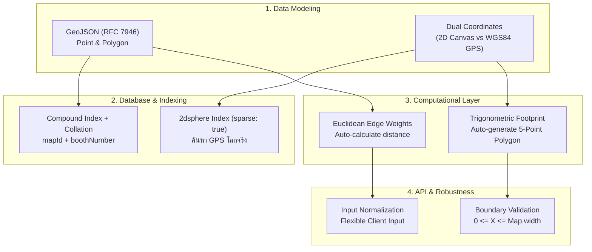

# คู่มือการนำเสนอสถาปัตยกรรม Indoor & Geospatial แก่ Senior Backend
**ไฟล์เอกสาร**: `/Users/admin/indoor-cms/doc/backend-senior-presentation-guide.md`  
**เป้าหมาย**: นำเสนอแนวคิด, สถาปัตยกรรมข้อมูล, และเทคนิคการแก้ปัญหาทางวิศวกรรมซอฟต์แวร์ให้เข้าใจง่าย มีหลักการรองรับ และตอบโจทย์ระดับ Senior

---

## 1. Executive Summary (ประโยคเปิด 30 วินาที - 1 นาที)

> *"ระบบ Indoor CMS นี้ถูกออกแบบมาเพื่อแก้ปัญหาคลาสสิกของระบบนำทางในอาคาร คือ **'Dual-Coordinate Problem'** หรือการเชื่อมโยงระหว่าง **'พิกัดระนาบ 2D ผังอาคาร (Indoor Cartesian: X, Y)'** กับ **'พิกัดภูมิศาสตร์โลกจริง (Outdoor Spherical: Longitude, Latitude)'** โดยเราเลือกใช้มาตรฐาน **GeoJSON (RFC 7946)** เป็นตัวกลาง และใช้ **MongoDB 2dsphere Index** ในการทำ Spatial Query ผสานกับ **Mathematical Graph Network** เพื่อรองรับการคำนวณเส้นทางเดิน (A*/Dijkstra) แบบ Real-time ครับ"*

---

## 2. เสาหลักของสถาปัตยกรรม (Core Architectural Pillars)

เวลานำเสนอให้แบ่งเป็น **4 เสาหลัก** ซึ่งเป็นสิ่งที่ Senior Backend ให้ความสำคัญสูงสุด:



---

### เสาหลักที่ 1: การออกแบบโมเดลข้อมูลแบบสองระนาบ (Dual-Coordinate Data Modeling)

**หลักการที่นำเสนอ:**
- **ทำไมไม่เก็บแค่ $X, Y$?**: ถ้าเก็บแค่ $X, Y$ แผนที่จะเป็นแค่ "ภาพวาดลอยๆ" ไม่สามารถระบุได้ว่าตึกนี้ตั้งอยู่ที่ไหนบนแผนที่โลก ไม่สามารถนำทางจากถนนนอกอาคารเข้ามาถึงหน้าบูธได้
- **ทำไมไม่เก็บแค่ GPS ($Lat, Lng$)?**: สัญญาณ GPS ไม่ทะลุอาคาร และความแม่นยำของ GPS ทั่วไปคลาดเคลื่อน 5-10 เมตร ไม่ละเอียดพอสำหรับการวางตำแหน่งบูธในระดับเซนติเมตร
- **วิธีแก้ปัญหาทางสถาปัตยกรรม**:
  - สร้าง Sub-schema มาตรฐาน **GeoJSON RFC 7946**:
    - `Point2D`: `{ type: 'Point', coordinates: [x, y] | [lng, lat] }`
    - `Polygon2D`: `{ type: 'Polygon', coordinates: number[][][] }`
  - บูธและแผนที่จะมี **2 ระนาบพร้อมกัน**:
    1. `position` & `footprint`: พิกัด 2D Cartesian สำหรับเรนเดอร์ลง Canvas/SVG และตรวจจับการชน
    2. `geo` & `boundary`: พิกัดโลกจริง WGS84 สำหรับการทำ Geo-referencing และ Search บนแผนที่โลก

---

### เสาหลักที่ 2: การออกแบบ Index และ Optimization (Database Engineering)

**จุดที่ต้องชี้ให้ Senior เห็นใน Code (`booth.schema.ts` & `map.schema.ts`):**

1. **`2dsphere` Index พร้อม `{ sparse: true }`**:
   ```typescript
   BoothSchema.index({ geo: '2dsphere' }, { sparse: true });
   ```
   - **หลักการ**: `2dsphere` เป็น Index พื้นผิวโลกทรงกลม คำนวณระยะทางเป็นเมตรจริงตามความโค้งของโลก รองรับคำสั่ง `$nearSphere` (ค้นหาบูธใกล้ฉัน) และ `$geoWithin` (ค้นหาบูธในโซน)
   - **ทำไมต้อง `sparse: true`?**: เพราะในการใช้งานจริง บางบูธอาจยังไม่ได้ผูกพิกัด GPS (มีแค่พิกัดในอาคาร) การใส่ `sparse: true` จะทำให้ MongoDB สร้าง Index เฉพาะ Document ที่มีฟิลด์ `geo` เท่านั้น **ประหยัด RAM/B-Tree Index Size** และไม่เกิด Error เมื่อฟิลด์เป็น Null/Undefined

2. **Compound Unique Index with Collation**:
   ```typescript
   BoothSchema.index(
     { mapId: 1, boothNumber: 1 },
     { unique: true, collation: { locale: 'en', strength: 2 } },
   );
   ```
   - **หลักการ**: ป้องกันรหัสบูธซ้ำในแผนที่เดียวกัน โดย Collation `strength: 2` ป้องกันความผิดพลาดของมนุษย์ เช่น บูธ `A01` กับ `a01` จะถือว่าเป็นบูธเดียวกันแบบ Case-insensitive

---

### เสาหลักที่ 3: Business Logic & การคำนวณทางคณิตศาสตร์อัตโนมัติ (Computational Layer)

**อธิบายว่า Backend ไม่ใช่แค่ CRUD แต่ทำหน้าที่เป็น Validation & Computational Engine:**

1. **Auto Footprint Generation (Trigonometric Rotation)**:
   - **ปัญหา**: ถ้าให้ Frontend ส่งรูปทรง Polygon 5 จุดมาเอง มักจะส่งข้อมูลผิด, ไม่ปิด Loop, หรือคำนวณองศาหมุนเพี้ยน
   - **การแก้ปัญหา**: ใน `booth.service.ts` มีฟังก์ชัน `calculateFootprint(x, y, w, d, rotation)`
   - คำนวณ Rotation Matrix รอบจุดศูนย์กลางผ่านตรีโกณมิติ:
     $$x' = x + dx \cdot \cos(\theta) - dy \cdot \sin(\theta)$$
     $$y' = y + dx \cdot \sin(\theta) + dy \cdot \cos(\theta)$$
   - คืนค่ากลับมาเป็น GeoJSON Polygon 5 จุดที่สมบูรณ์และถูกต้องตามมาตรฐานเสมอ

2. **Auto Graph Edge Weights (Euclidean Distance)**:
   - ใน `path.service.ts` เมื่อแอดมินลากเส้นทางเชื่อมระหว่าง Node A ไป Node B ระบบจะดึงพิกัด `position.coordinates` ของทั้งสองจุดมาคำนวณหาระยะทางจริงอัตโนมัติ:
     $$\text{weight} = \sqrt{(x_2 - x_1)^2 + (y_2 - y_1)^2}$$
   - ทำให้โครงข่ายทางเดินมีค่าน้ำหนัก (Weight) แม่นยำ พร้อมส่งต่อให้อัลกอริทึมหาเส้นทางสั้นสุดทันที

---

### เสาหลักที่ 4: ความยืดหยุ่นและการตรวจสอบข้อมูล (Robustness & Developer Experience)

1. **Input Normalization**:
   - Backend ออกแบบมาให้รองรับอินพุตที่หลากหลายจาก Frontend ไม่ว่าจะส่งมาเป็น:
     - Full GeoJSON: `{ type: 'Point', coordinates: [100, 200] }`
     - Array: `[100, 200]`
     - Flat Properties: `x: 100, y: 200`
   - Backend จะทำการ Normalize เป็นมาตรฐานเดียวกันทั้งหมดก่อนจัดเก็บ ป้องกันปัญหา Schema ไม่เป็นหนึ่งเดียว
2. **Strict Boundary Validation**:
   - ตรวจสอบว่าพิกัดของ Node และบูธ ไม่หลุดออกนอกขอบเขตความกว้างและความสูงของผังอาคาร ($0 \le x \le \text{map.width}$ และ $0 \le y \le \text{map.height}$)

---

## 3. สคริปต์พูดนำเสนอแบบทีละขั้นตอน (Presentation Walkthrough Script)

### สไลด์/ช่วงที่ 1: แนะนำเป้าหมายและปัญหา (Problem & Vision)
> *"สวัสดีครับ วันนี้ขอสรุปภาพรวมสถาปัตยกรรม Indoor Map & Navigation Backend ที่เราได้วางโครงสร้างไว้ครับ*  
> *เป้าหมายหลักคือสร้างระบบจัดการผังในอาคารที่ยืดหยุ่น รองรับทั้งการวาดรูปทรงบน Canvas และรองรับการค้นหาผ่าน GPS โลกจริงอย่างเป็นมาตรฐาน โดยไม่ทำให้โค้ดสับสนหรือผูกมัดกับเฟรมเวิร์กวาดภาพใดภาพหนึ่งครับ"*

### สไลด์/ช่วงที่ 2: โครงสร้างข้อมูล (Data Modeling)
> *"แกนหลักที่เราเลือกใช้คือมาตรฐาน **GeoJSON RFC 7946** โดยแยกมิติออกเป็น 2 ส่วน:*
> 1. *มิติในอาคาร (Indoor 2D): เราใช้ `position` (Point) และ `footprint` (Polygon) กำหนดพิกัด X, Y บน Canvas*
> 2. *มิติโลกจริง (GIS): เราใช้ `geo` (Point) และ `boundary` (Polygon) เก็บพิกัด Longitude, Latitude บนมาตรฐาน WGS84*  
> *การทำแบบนี้ทำให้ระบบพร้อมรองรับทั้งงานจัดแสดงนิทรรศการ (Exhibition) และการทำ Smart Facility Management ในอนาคตครับ"*

### สไลด์/ช่วงที่ 3: การเพิ่มประสิทธิภาพฐานข้อมูล (Database Optimization)
> *"ในฝั่งฐานข้อมูล MongoDB เราไม่ได้ทำแค่การจัดเก็บแบบพื้นฐาน แต่เราคำนึงถึง Performance:*
> - *เราสร้าง **Compound Unique Index** บน `mapId + boothNumber` พร้อมกำหนด Collation ป้องกันการสร้างรหัสบูธซ้ำแม้จะพิมพ์ตัวพิมพ์เล็ก-ใหญ่ต่างกัน*
> - *เราสร้าง **2dsphere Index** บนฟิลด์ `geo` แบบ **`sparse: true`** เพื่อเปิดความสามารถในการทำ Geospatial Queries เช่น `$nearSphere` สำหรับค้นหาบูธรอบตัวผู้ใช้งาน โดยที่ index จะไม่กิน memory โดยเปล่าประโยชน์หากบูธนั้นไม่มีพิกัดโลกจริง"*

### สไลด์/ช่วงที่ 4: การทำงานเบื้องหลัง (Computational Engine)
> *"นอกจากนี้ ใน Service Layer เราได้วาง Automation ไว้ 2 เรื่อง:*
> 1. *ฟังก์ชัน `calculateFootprint` ช่วยแปลงขนาดกว้าง-ลึก และมุมหมุน ให้กลายเป็น Polygon 5 จุดอัตโนมัติผ่านตรีโกณมิติ ลดภาระของ Frontend*
> 2. *ฟังก์ชันใน `PathService` ที่คำนวณระยะทางแบบ Euclidean Distance ระหว่าง Node เพื่อสร้าง Graph Weight อัตโนมัติ ทำให้ได้ข้อมูลเครือข่ายเส้นทางเดินที่พร้อมนำไปรัน Routing Algorithm เช่น A* หรือ Dijkstra ได้ทันทีครับ"*

---

## 4. แนวทางการตอบคำถามเจาะลึก (Senior Q&A Defense Guide)

| คำถามที่ Senior มักจะถาม | แนวทางการตอบแบบมืออาชีพ |
| :--- | :--- |
| **Q1: ทำไมใช้ MongoDB แทนที่จะเป็น PostgreSQL + PostGIS?** | **ตอบ**: *"ระบบนี้เป็น CMS ที่เน้นความยืดหยุ่นของ Document (เช่น บูธแต่ละประเภทมี metadata ต่างกัน) และ MongoDB มี Geospatial Engine ในตัวที่รองรับ GeoJSON และ `2dsphere` อยู่แล้ว ทำให้เราได้ทั้งความยืดหยุ่นของ JSON และ Spatial Query โดยไม่ต้องเพิ่มความซับซ้อนของโครงสร้าง Relational ในระยะเริ่มต้นครับ"* |
| **Q2: ทำไมไม่ให้ Frontend คำนวณ Footprint Polygon เองแล้วส่งมา?** | **ตอบ**: *"เป็นเรื่องของ Data Integrity และ Single Source of Truth ครับ หากปล่อยให้ Client แต่ละแพลตฟอร์ม (Web, Mobile, Admin CMS) คำนวณเอง อาจเกิดความคลาดเคลื่อนของการปัดเศษทศนิยมหรือทิศทางองศา การทำบน Backend การันตีว่ารูปทรงที่บันทึกลงฐานข้อมูลถูกต้องตามกฎ Topology เสมอครับ"* |
| **Q3: ทำไม Edge Weight ถึงใช้ Euclidean แทนที่จะวัดเส้นทางเดินโค้ง?** | **ตอบ**: *"ใน Graph ทางเดิน เราแบ่ง Segment ให้เป็นเส้นตรงย่อยๆ ระหว่าง Waypoint อยู่แล้วครับ หากเป็นทางโค้ง แอดมินสามารถเพิ่ม Node ระหว่างจุดเพื่อสะท้อนความโค้งได้ การใช้ Euclidean จึงถูกต้อง แม่นยำ และใช้ CPU ต่ำสุด ($O(1)$) ในการคำนวณครับ"* |
| **Q4: ถ้าตึกมีหลายชั้น (Multi-floor) โครงสร้างนี้รองรับไหม?** | **ตอบ**: *"รองรับครับ เพราะแผนที่หลักมีฟิลด์ `floor` และ `building` กำกับอยู่แล้ว และใน `PathNode` สามารถกำหนด `type: 'stairs'` หรือ `elevator` เพื่อสร้าง Edge ข้ามแผนที่ (Inter-floor connectivity) ได้ในอนาคตครับ"* |
