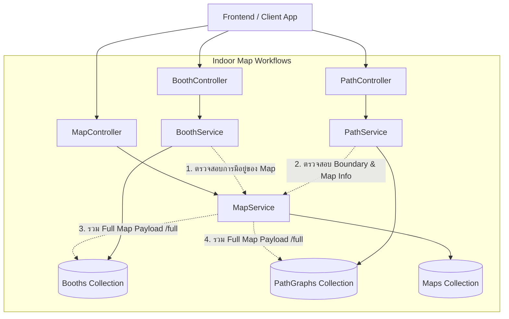

# 🏗️ สถาปัตยกรรมการทำงานของ Services และ Workflows (Indoor CMS)

เอกสารนี้อธิบายรายละเอียดโครงสร้าง การทำงาน ความรับผิดชอบ และความสัมพันธ์ของแต่ละ **Service** ในแต่ละ **Workflow** ภายใต้ระบบ `indoor-cms`

---

## 📑 สารบัญ
1. [ภาพรวมสถาปัตยกรรม (Architecture Overview)](#1-ภาพรวมสถาปัตยกรรม-architecture-overview)
2. [MapService: บริหารจัดการผังและแผนที่หลัก](#2-mapservice-บริหารจัดการผังและแผนที่หลัก)
3. [BoothService: บริหารจัดการพื้นที่และบูธแสดงสินค้า](#3-boothservice-บริหารจัดการพื้นที่และบูธแสดงสินค้า)
4. [PathService: โครงข่ายเส้นทางเดินและระบบนำทาง A*](#4-pathservice-โครงข่ายเส้นทางเดินและระบบนำทาง-a)
5. [ตารางความสัมพันธ์และการประสานงานระหว่าง Services (Interactions)](#5-ตารางความสัมพันธ์และการประสานงานระหว่าง-services)
6. [แนวทางการนำไปใช้งานกับระบบ Frontend (Integration Guide)](#6-แนวทางการนำไปใช้งานกับระบบ-frontend)

---

## 1. ภาพรวมสถาปัตยกรรม (Architecture Overview)

ระบบ Indoor CMS ออกแบบตามหลัก **Single Responsibility Principle (SRP)** และ **Domain-Driven Design (DDD)** โดยแบ่งฟีเจอร์ของระบบแผนที่ภายในอาคารออกเป็น 3 โดเมนหลัก:
1. **Map Domain**: ขอบเขตทางกายภาพ, แปลนอาคาร, มิติพิกัด และพิกัดดาวเทียมโลกจริง (GIS)
2. **Booth Domain**: ออบเจกต์ในอาคาร, บูธร้านค้า, ห้อง, จุดบริการ และรูปทรงเรขาคณิต (Footprint)
3. **Path Domain**: โครงข่ายเส้นทางเดินคณิตศาสตร์ (Graph Topology), จุดทางแยก (Nodes), เส้นเชื่อม (Edges) สำหรับอัลกอริทึม A*

---

## 2. MapService: บริหารจัดการผังและแผนที่หลัก
* **ไฟล์**: `src/workflow/indoor-map/map/map.service.ts`
* **Controller**: `MapController` (`/maps`)
* **Mongoose Models ที่ใช้**: `MapModel`, `BoothModel`, `PathGraphModel`

### 2.1 หน้าที่หลัก (Responsibilities)
`MapService` ทำหน้าที่เป็นรากฐานของระบบ เป็นศูนย์กลางการบริหารจัดการข้อมูลผังอาคาร (Floor Plans) กำหนดขนาดพิกัด กว้าง $\times$ สูง สำหรับการวาดบน Canvas/Three.js และกำหนดพิกัดดาวเทียมโลกจริง (GIS WGS84) สำหรับการวางซ้อนบนแผนที่โลก

### 2.2 รายละเอียดเมธอดการทำงาน
| เมธอด | หน้าที่และการทำงานภายใน |
| :--- | :--- |
| `createMap(dto)` | • ตรวจสอบพิกัด WGS84 (`geo.coordinates`: Longitude -180..180, Latitude -90..90) • บันทึกข้อมูลผัง: ชื่อฮอลล์, อาคาร, ชั้น, ขนาด (`width`, `height`), URL รูปแปลน, มุมหมุนเทียบทิศเหนือ (`rotation`), และขอบเขตอาณาเขตบนแผนที่โลก (`boundary`) • ป้องกันการสร้างแผนที่ซ้ำในอาคาร-ฮอลล์-ชั้นเดียวกันผ่าน Unique Compound Index |
| `findAllMaps()` | • ดึงรายการแผนที่ทั้งหมดในระบบ เรียงลำดับจากสร้างล่าสุดไปเก่าสุด (`createdAt: -1`) |
| `findMapById(id)` | • ค้นหาแผนที่เดี่ยว รองรับทั้งค้นหาด้วย **UUID** และค้นหาด้วย **ชื่อฮอลล์** • หากไม่พบจะโยนข้อผิดพลาด `404 NotFoundException` |
| `updateMap(id, dto)` | • รองรับการอัปเดตข้อมูลบางส่วน (**PATCH**) • ตรวจสอบความถูกต้องของพิกัด WGS84 ใหม่หากมีการส่งมา • มี Conflict Detection แจ้งเตือนกรณีเปลี่ยนชื่อไปซ้ำกับแผนที่อื่น |
| `deleteMap(id)` | • **Cascade Deletion**: เมื่อลบแผนที่ ระบบจะทำการลบ **บูธทั้งหมด** (`boothModel.deleteMany`) และ **กราฟทางเดินทั้งหมด** (`pathGraphModel.deleteOne`) ที่ผูกกับแผนที่นั้นทิ้งพร้อมกันทันที ป้องกันข้อมูลขยะตกค้าง |
| `findMapWithBooths(id)` | • **Unified Full-Map Aggregator**: ยิงดึงข้อมูล Map, บูธทั้งหมด, และกราฟทางเดิน พร้อมกันผ่าน `Promise.all` • จัดรูปแบบข้อมูลให้พร้อมสำหรับ Frontend นำไป Render บน Canvas/3D Scene ทันทีใน 1 Request (`GET /maps/:id/full`) |

---

## 3. BoothService: บริหารจัดการพื้นที่และบูธแสดงสินค้า
* **ไฟล์**: `src/workflow/indoor-map/booth/booth.service.ts`
* **Controller**: `BoothController` (`/maps/:mapId/booths`, `/booths/:id`)
* **Mongoose Models & Services ที่ใช้**: `BoothModel`, `MapService`

### 3.1 หน้าที่หลัก (Responsibilities)
`BoothService` รับผิดชอบการจัดการข้อมูลบูธ ห้องประชุม จุดบริการ หรือสิ่งอำนวยความสะดวกภายในแผนที่ จัดการพิกัดตำแหน่งระนาบ 2D, มิติ 3D (กว้าง $\times$ ลึก $\times$ สูง), และคำนวณรูปทรงขอบเขตระนาบ 2D (Footprint Polygon) อัตโนมัติด้วยหลักตรีโกณมิติ

### 3.2 รายละเอียดเมธอดการทำงาน
| เมธอด | หน้าที่และการทำงานภายใน |
| :--- | :--- |
| `calculateFootprint(...)` | • นำจุดพิกัด $(x, y)$, ขนาดกว้าง-ลึก (`width`, `depth`), และมุมหมุน (`rotation`) มาคำนวณผ่าน **ตรีโกณมิติ ($\sin, \cos$)** • สร้างจุดยอดมุม 5 จุดของ GeoJSON Polygon ที่สะท้อนตำแหน่งและการหมุนจริงของบูธ |
| `createBooth(mapId, dto)` | • ตรวจสอบว่า `mapId` มีอยู่จริงผ่าน `MapService` • **Input Normalization**: รองรับพิกัดทั้งแบบ GeoJSON Point, Array `[x, y]`, และ Flat `x, y` • หาก Frontend ไม่ได้ส่ง `footprint` มา ระบบจะเรียก `calculateFootprint` สร้างรูปทรงให้อัตโนมัติ • ป้องกันรหัสบูธซ้ำในแผนที่เดียวกัน (`mapId + boothNumber`) |
| `findBoothsByMapId(mapId)` | • ดึงรายการบูธทั้งหมดประจำแผนที่ พร้อมฟอร์แมตข้อมูลเป็น GeoJSON มาตรฐาน |
| `findBoothById(id)` | • ค้นหาบูธเดี่ยวตาม UUID |
| `updateBooth(id, dto)` | • แก้ไขข้อมูลบูธหรือขยับตำแหน่ง • **Auto-Footprint Recalculation**: หากมีการแก้ไขพิกัด ขนาด หรือมุมหมุน ระบบจะคำนวณขอบเขต `footprint` ใหม่ให้อัตโนมัติทันที |
| `deleteBooth(id)` | • ลบบูธเดี่ยวออกจากระบบ |

---

## 4. PathService: โครงข่ายเส้นทางเดินและระบบนำทาง A*
* **ไฟล์**: `src/workflow/indoor-map/path/path.service.ts`
* **Controller**: `PathController` (`/maps/:mapId/paths`)
* **Mongoose Models & Services ที่ใช้**: `PathGraphModel`, `MapService`

### 4.1 หน้าที่หลัก (Responsibilities)
`PathService` รับผิดชอบโครงสร้างเชิงคณิตศาสตร์ของกราฟทางเดิน $G = (V, E)$ ประกอบด้วยจุดเชื่อมต่อ (Nodes/Waypoints) และเส้นทางเดิน (Edges) เพื่อส่งต่อให้ระบบนำทางหรืออัลกอริทึม A* / Dijkstra นำไปคำนวณเส้นทางเดินที่สั้นที่สุด

### 4.2 ระบบตรวจสอบความสมบูรณ์ของกราฟ (Graph Integrity Engine)
ภายใน Service มีระบบป้องกันข้อผิดพลาดที่อาจทำให้อัลกอริทึม A* ขัดข้อง:
1. **Boundary Check**: ตรวจสอบว่าพิกัด $x, y$ ของ Node อยู่ภายในขนาด $0 \le x \le \text{map.width}$ และ $0 \le y \le \text{map.height}$
2. **Self-Loop Prevention**: ป้องกันเส้นทางที่เชื่อมจุดตัวเอง (`edge.from === edge.to`)
3. **Node Existence Check**: ตรวจสอบว่าจุดต้นทางและปลายทางของ Edge มีอยู่ในรายการ Node จริง
4. **Duplicate Edge Prevention**: ป้องกันการส่งเส้นทางเชื่อมซ้ำซ้อน
5. **Euclidean Distance Auto-Calculation**: คำนวณค่าน้ำหนักระยะทางอัตโนมัติ $\text{weight} = \sqrt{(x_2 - x_1)^2 + (y_2 - y_1)^2}$ หากไม่ได้ระบุ
6. **Isolated Nodes Detection**: ตรวจจับและแจ้งเตือนจุดที่ไม่มีเส้นทางเชื่อมโยงเลย (จุดลอย)

### 4.3 รายละเอียดเมธอดการทำงาน
| เมธอด | หน้าที่และการทำงานภายใน |
| :--- | :--- |
| `savePathGraph(mapId, dto)` | • **Full Graph Upsert (POST)**: สำหรับ Map Editor เมื่อจัดผังทางเดินเสร็จแล้วกดบันทึกก้อนใหญ่ บันทึกทั้ง Nodes และ Edges พร้อมรัน Integrity Check ทั้งหมด |
| `patchPathGraph(mapId, dto)` | • **Safe Partial Update (PATCH)**:   - `moveNodes`: ย้ายพิกัดจุด พร้อม **คำนวณระยะทาง `weight` ของทุกเส้นเชื่อมใหม่อัตโนมัติ**   - `deleteNodeIds`: ลบจุด พร้อม **Cascade ลบ Edges ที่ต่ออยู่ทิ้งทั้งหมด** ป้องกันเส้นลอย (Zero Dangling Edges)   - `addNodes` / `addEdges` / `deleteEdges`: ปรับแต่งโครงข่ายเฉพาะจุดอย่างปลอดภัย |
| `findPathGraphByMapId(mapId)` | • ดึงข้อมูล Nodes, Edges, และรายการ Isolated Nodes ประจำแผนที่ |
| `deletePathGraph(mapId)` | • ลบโครงข่ายเส้นทางเดินของแผนที่นั้น |

---

## 5. ตารางความสัมพันธ์และการประสานงานระหว่าง Services

| ผู้เรียกใช้งาน (Caller) | ผู้ถูกเรียกใช้งาน (Callee) | จุดประสงค์การเรียกใช้งาน (Purpose) |
| :--- | :--- | :--- |
| `BoothService` | `MapService.findMapById` | ตรวจสอบว่ามีแผนที่อยู่จริงก่อนสร้างบูธ และดึง `_id` อ้างอิง |
| `PathService` | `MapService.findMapById` | ตรวจสอบว่ามีแผนที่อยู่จริง และนำขนาด `width`, `height` มาทำ **Boundary Check** จุดทางเดิน |
| `MapService` | `BoothModel.deleteMany` | Cascade ลบบูธทั้งหมดที่อยู่ในแผนที่ เมื่อแผนที่ถูกลบ |
| `MapService` | `PathGraphModel.deleteOne` | Cascade ลบเส้นทางเดินทั้งหมด เมื่อแผนที่ถูกลบ |
| `MapService` | `BoothModel.find` & `PathGraphModel.findOne` | รวมข้อมูลผัง + บูธ + เส้นทางเดินทั้งหมดในคำสั่งเดียว (`/maps/:id/full`) |

---

## 6. แนวทางการนำไปใช้งานกับระบบ Frontend

1. **การโหลดและแสดงผลผังแผนที่ (Rendering Canvas / 3D Scene)**:
   * Frontend ยิงคำขอ `GET /maps/:id/full` เพียงครั้งเดียว จะได้รับทั้งภาพแปลนอาคาร ขนาดผัง ขอบเขตบูธทั้งหมด (`footprint`) และโครงข่ายทางเดิน (`paths`) ไปเรนเดอร์ได้ทันที
2. **การวาดและจัดตำแหน่งบูธ (Booth Placement)**:
   * Frontend ส่งพิกัด $x, y$ และขนาดกว้าง-ลึก ไปที่ `POST /maps/:mapId/booths` ระบบจะแปลงเป็นรูปทรง Polygon ที่หมุนตามองศาให้อัตโนมัติ
3. **ระบบนำทางและการหาเส้นทางสั้นที่สุด (Pathfinding / A*)**:
   * Frontend ดึง `paths` (Nodes + Edges) ไปใส่ในกราฟ Adjacency List
   * นำไปรันอัลกอริทึม **A* Algorithm** หรือ **Dijkstra** เพื่อคำนวณเส้นทางเดินจากตำแหน่งปัจจุบันไปยังบูธเป้าหมายได้อย่างแม่นยำและไม่มีปัญหาเส้นทางขาดตอน
